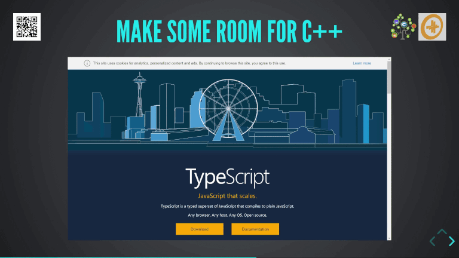

# nxxm `belle::vue` : CppCon 2018 slides
Making room for C++ on the Web 

## Presentation Synopsys
The elegance how a C++17 application can bind to HTML5 will be shown, while running a C++17 data-model on WebAssembly in the server and the browser.

While we will look at the useful libraries, tips and techniques C++17 offers in this context. We will weigh the gains and the pains of modern C++ applied to the HTML5 user experience.

The effective impact on maintainability, performance & lightness of web applications will be measured in comparison to typical web development techniques.

### Announcemnts in this talk : 
This was the announcement of the starting belle::vue effort and nxxm and h
 The C++ effort to the web

Here we list libraries part of the Bellevue effort :
- [nxxm](https://nxxm.github.io/) : html5 files compilation, dependency and easy-build with WebAssembly.
- [js::bind](https://github.com/nxxm/js-bind) : bind any C++ function to the Javascript Host API.
- [xxhr](https://nxxm.github.io/xxhr) : HTTP Requests cross-platform &amp; in the Browser
- [belle::vue](https://github.com/bellevue) : HTML5 Dom access, HTML5 view engines.
- [bete](https://github.com/nxxm/bete) : WebServer, Websocket Observables Data Types

## Join the project or take contact
[nxxm](https://nxxm.github.io/) : [Discussion Group / Mailing List](https://groups.google.com/forum/#!forum/nxxm)
Damien Buhl
damien.buhl@lecbna.org
